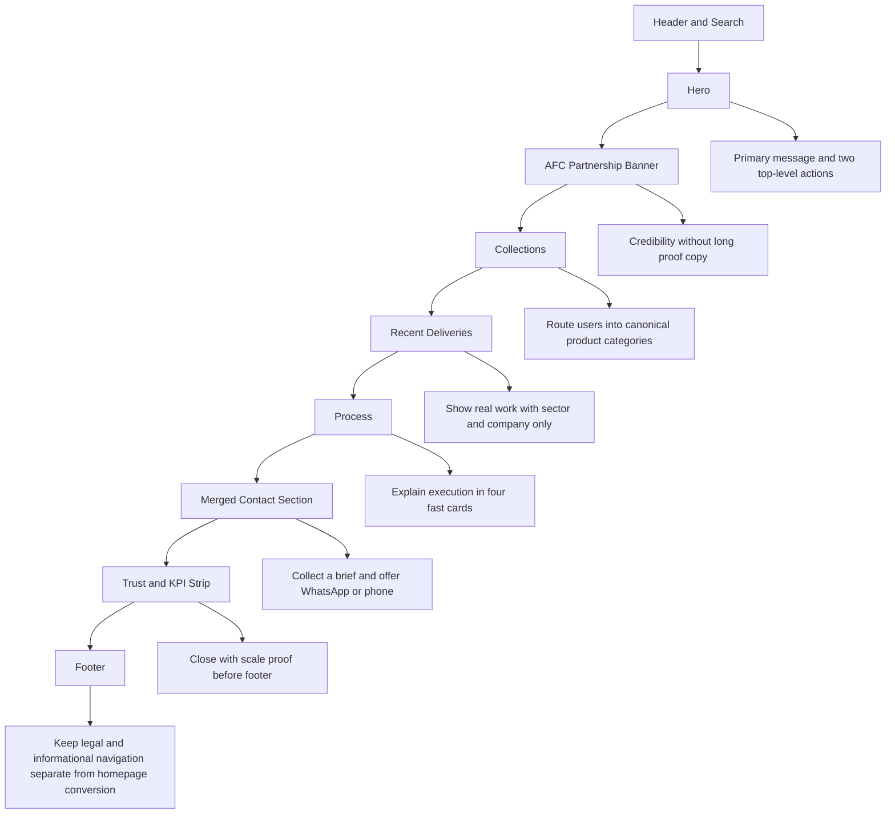

# Homepage IA Flowchart

## Purpose
This flowchart documents the current intended homepage information architecture after the Process 1 cleanup. It exists so layout, copy, and conversion decisions are explicit instead of spread across components.

## Flowchart

## Layout Rationale
- `Hero`: first message only. It should not carry extra proof clutter.
- `AFC Partnership Banner`: early credibility anchor. Strong because it is compact and visually distinct.
- `Collections`: first discovery layer. This must use live canonical category routes only.
- `Recent Deliveries`: proof by real work, not by extra copy. Cards should show sector and company name only.
- `Process`: operational reassurance after discovery and proof.
- `Merged Contact Section`: one closing conversion surface, not multiple competing asks.
- `Trust and KPI Strip`: late-stage proof, moved near the footer so it supports the close instead of interrupting discovery.
- `Footer`: informational close only, not another homepage sales panel.

## Component Ownership
- `app/page.tsx`: section order only
- `data/site/homepage.ts`: homepage content truth
- `components/home/*`: section rendering
- `components/shared/ContactTeaser.tsx`: homepage closing conversion surface
- `components/site/Footer.tsx`: footer-only information
- `components/ui/WhatsAppCTA.tsx`: route-aware floating quick contact

## Current Guardrails
- No homepage card should use stale `?category=` routing.
- No homepage project card should show city/state.
- Homepage quick contact should not use email as a primary action.
- Footer contact metadata must not become a second homepage CTA section.
