# Supabase Redo Flowchart (AFC Specs + Archives)

```mermaid
flowchart LR
  A["Start: Freeze writes + backup current Supabase"] --> B["Load AFC sources from archives"]
  B --> C["Extract canonical product set (slug, category, series)"]
  C --> D["Extract canonical specs (dimensions, materials, features)"]
  D --> E["Extract canonical media map (flagship + gallery order)"]
  E --> F["Build normalized staging dataset"]
  F --> G{"Data quality gates"}
  G -->|"Fail"| H["Emit error report by slug and stop"]
  G -->|"Pass"| I["Create migration snapshot + transaction plan"]
  I --> J["Upsert categories"]
  J --> K["Upsert products core fields"]
  K --> L["Upsert metadata + specs from AFC"]
  L --> M["Upsert image ordering and asset paths"]
  M --> N["Run full product-page audit (all slugs)"]
  N --> O{"Audit clean?"}
  O -->|"No"| P["Patch mismatches + rerun audit"]
  P --> N
  O -->|"Yes"| Q["Publish report + mark migration complete"]
  H --> R["Rollback: keep existing Supabase unchanged"]
  Q --> S["End"]
```

## Canonical Sources
- `scripts/seed_data.sql` for full specs and structured product metadata.
- `docs/migrations/backups/*.json` for AFC/category-subcategory corrections.
- `scripts/catalog-*.json` for archived catalog consistency checks.
- `docs/checkpoints/live-audit-2026-03-02.json` for route/name cross-check baselines.
